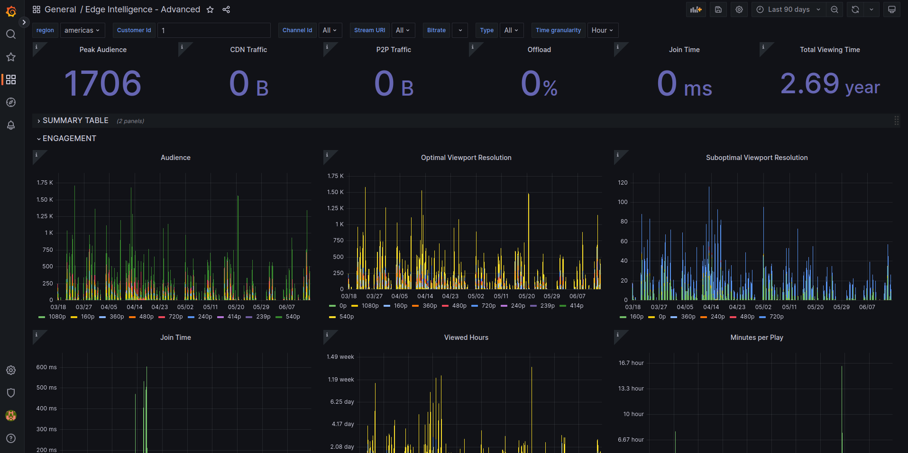

<!-- markdownlint-disable -->
<style>
/* The below `img` style sets the default CSS styling for all images hereafter in this markdown
file. */
img
{
    /* Default display value is `inline-block`. Set it to `block` to prevent surrounding text from
    wrapping around the image. Instead, `block` format will force the text to be above or below the
    image, but never to the sides. */
    display:block; 
    float:none; 
    margin-left:auto;
    margin-right:auto;
    padding:1em;
}
</style>
<!-- markdownlint-enable -->
# Self-hosted Grafana integration with Edge Analytics

## Requirements

* Grafana OSS 9.x.x
* Docker 20.10+ (linux)
* docker-compose 1.29+ (linux)

## Instructions

We have supplied a Docker Compose file that simplifies the installation and configuration of Grafana,
along with all the necessary dependencies. If you are interested in delving into the intricacies of
what happens behind the scenes, you can refer to the manual installation
[instructions.](./manual-installation.md)

### Getting Grafana up and running (Linux only)

1. First download the necessary files:
   * The docker-compose file from [here](../docker-compose.yaml).
   * The [provisioning][provisioning] folder.
2. Create an `.env` or rename the provided `.env.example` file.
   * The `.env` file should contain your Analytics API token
   (Available on [System73 Portal][s73-portal]):

      ```text
      ANALYTICS_API_TOKEN="YOUR_TOKEN_HERE"
      ```

3. On a terminal opened in the same directory where you downloaded the `docker-compose.yaml`, the
provisioning folder and .env file, you can simply type:

   ```console
   docker compose up -d grafana
   ```

4. Go to the browser and open the page [http://localhost:3000](http://localhost:3000).
On the login page enter the default admin credentials
User: ***admin***, Password: ***admin***
5. For increased security Grafana prompts for setting a new admin password, please do so or skip it.
6. Once you are logged in, you can go to
[http://localhost:3000/dashboards](http://localhost:3000/dashboards) and select your dashboard.
   > **Note**:
   >
   > In order to get the benefits from the Advanced Dashboard you need to have an EA account with the
   > Advanced Tier [enabled][ea-credentials].
7. After that you just need to select the correct region and the Edge Intelligence Id that you have
been assigned.
   
8. Success!
   

[ea-credentials]: https://docs.system73.com/services/edge-intelligence/ei-credentials/
[provisioning]: https://github.com/System73/edge-analytics-grafana-setup/tree/main/docs/files/provisioning
[s73-portal]: https://manage.system73.com
