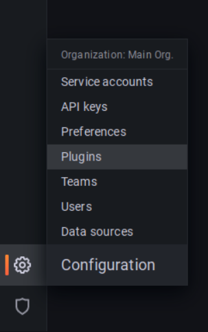
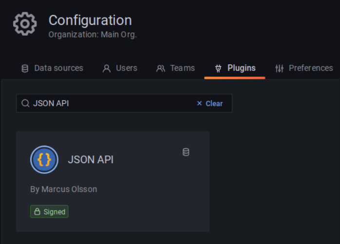
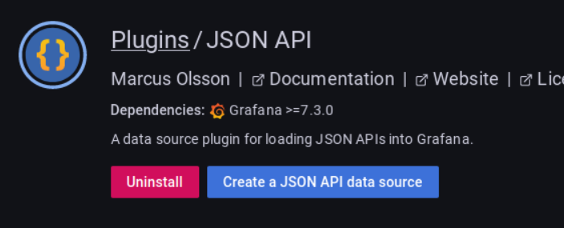
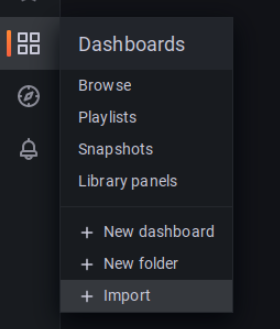
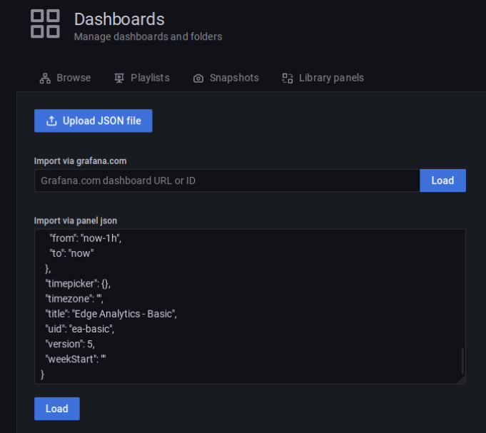
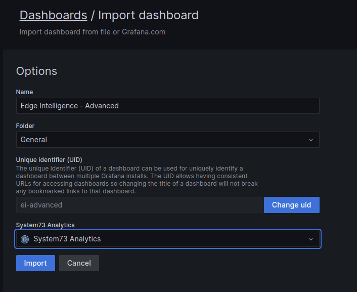

<!-- markdownlint-disable -->
<style>
/* The below `img` style sets the default CSS styling for all images hereafter in this markdown
file. */
img
{
    /* Default display value is `inline-block`. Set it to `block` to prevent surrounding text from
    wrapping around the image. Instead, `block` format will force the text to be above or below the
    image, but never to the sides. */
    display:block; 
    float:none; 
    margin-left:auto;
    margin-right:auto;
    padding:1em;
}
</style>
<!-- markdownlint-enable -->
# Self-hosted Grafana integration with Edge Analytics

## Requirements for manual setup

* Grafana OSS 9.x.x
* Docker 20.10+ (linux)

### Getting Grafana up and running (Linux only)

1. First install docker if you have not done so, following [this](https://docs.docker.com/engine/install/).

2. Then on a terminal you can simply type:

   ```console
   docker run -d -p 3000:3000 --name=grafana \
      -e "GF_PLUGINS_ALLOW_LOADING_UNSIGNED_PLUGINS=system73-3dtopology-panel,system73-3dglobe-panel" \
      -e "GF_INSTALL_PLUGINS=marcusolsson-json-datasource, https://cdn.s73cloud.com/grafana-plugin/system73-3dtopology-panel-1.1.1.zip;system73-3dtopology-panel, \
         https://cdn.s73cloud.com/grafana-plugin/system73-3dglobe-panel-1.1.0.zip;system73-3dglobe-panel" \
      grafana/grafana-oss:9.4.7
   ```

3. Go to the browser and open the page [http://localhost:3000](http://localhost:3000).
On the login page enter the default admin credentials
User: ***admin***, Password: ***admin***
4. For increased security Grafana prompts for setting a new admin password, please do so or skip it.

### Configuring the required datasource

To integrate with the Edge Analytics API Grafana needs a plugin that is able to consume JSON APIs.
There are many plugins available to do so but the plugin
[JSON API Data Source for Grafana][grafana-json-datasource] is officially maintained by Grafana Labs
and it perfectly covers our needs.

The plugin was already installed with the docker command.

1. Navigate to the ***Configuration > Plugins*** section.
   
2. Search for the term “JSON API”, you should select the plugin developed by Marcus Olsson.
   
3. Click on the ***Create a JSON API*** data source button.
   
4. Configure the data source with the following values:
   1. Name: `System73 Analytics`
   2. URL: [https://api.system73.com/analytics](https://api.system73.com/analytics)
   3. Add a header on ***Custom HTTP Headers*** with the following:
      1. Header:

         ```text
         Authorization
         ```

      2. Value: (Available on [System73 Portal][s73-portal])

         ```text
         Bearer <edge_analytics_api_key>
         ```

   
5. Click on the ***Save & test*** button (ignore the warning message) and click on the Back button.

### Importing Edge Analytics dashboards

You can import the Edge Analytics dashboards that we have made available:

* [Basic dashboard](./files/provisioning/dashboards/ea-basic-dashboard.json)
* [Advanced dashboard](./files/provisioning/dashboards/ea-advanced-dashboard.json)

> **Note**:
>
> In order to get the benefits from the Advanced Dashboard you need to have an EA account with the
> Advanced Tier [enabled][ea-credentials].

To import a dashboard:

1. Click on the sidebar’s ***Dashboards > Import***
   
2. You can either upload the dashboard file or simply copy & paste the file context. Since we are
using a container without specific host-mounted volumes it is better to simply copy its content.
   
3. Click on the ***Load button***
4. You can choose the dashboard uid, tittle, folder as you want but make sure to select the
***System73 Analytics*** as the dashboard datasource in the drop-down menu.
   

5. Click on the ***Import*** button
6. After that you just need to select the correct region and the Edge Intelligence Id that you have
been assigned.
   
7. Success!
   

[ea-credentials]: https://docs.system73.com/services/edge-intelligence/ei-credentials/
[grafana-json-datasource]: https://grafana.github.io/grafana-json-datasource/
[s73-portal]: https://manage.system73.com
